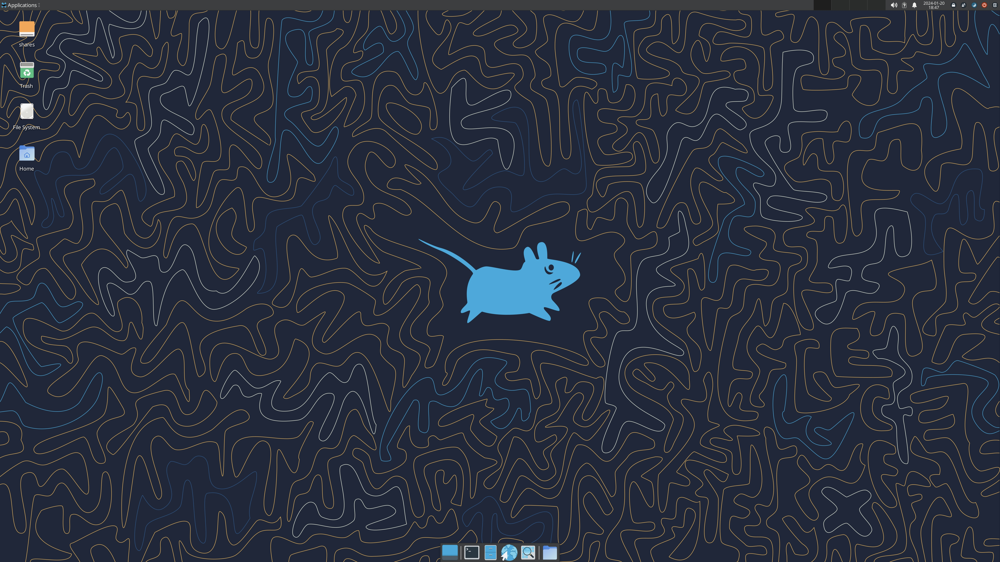

## FreeBSD Xfce4 on VMware Installation Guide

A guide to install the Xfce Desktop Environment on FreeBSD 12.2 running as a guest operating system on VMware (tested on VMware Fusion 11.5.7). This guide includes configuration files and an optional configuration script.

## Requirements

* FreeBSD installed as a guest operating system on VMware.

* Installation of sudo to run install script `pkg install sudo`

* Installation of git to clone this repo `sudo pkg install git`

* Installation of bash to run install script `sudo pkg install bash`

There is currently a [bug](https://bugs.freebsd.org/bugzilla/show_bug.cgi?id=251866) that prevents FreeBSD 12.2 from booting with EFI on VMware. So if you prefer EFI you will need to install FreeBSD 12.1 and then upgrade to 12.2 using `freebsd-update`. Otherwise just boot FreeBSD 12.2 with BIOS.

## ISOs for Installing FreeBSD

* [FreeBSD-12.2-RELEASE-amd64-bootonly.iso](https://download.freebsd.org/ftp/releases/amd64/amd64/ISO-IMAGES/12.2/FreeBSD-12.2-RELEASE-amd64-bootonly.iso "FreeBSD-12.2-RELEASE-amd64-bootonly.iso")

* [FreeBSD-12.1-RELEASE-amd64-bootonly.iso](https://download.freebsd.org/ftp/releases/amd64/amd64/ISO-IMAGES/12.1/FreeBSD-12.1-RELEASE-amd64-bootonly.iso "FreeBSD-12.1-RELEASE-amd64-bootonly.iso")

## Quick install Xfce 4.16 and required packages

```bash
git clone https://github.com/coonrad/FreeBSD-Xfce4-VMware-Install-Guide.git
cd FreeBSD-Xfce4-VMware-Install-Guide
sudo ./xfce-install.sh
```

## Manually install Xfce 4.16 and required packages

Update the pkg repository to `latest` to install the most recent version of Xfce:

```bash
sudo mkdir -p /usr/local/etc/pkg/repos
sudo vi /usr/local/etc/pkg/repos/FreeBSD.conf
```

Add the following to `FreeBSD.conf` and run `pkg update`:

```bash
FreeBSD: {
  url: "pkg+http://pkg.FreeBSD.org/${ABI}/latest"
}
```

When you run `pkg -vv` you should see the following:

```bash
Repositories:
  FreeBSD: {
    url             : "pkg+http://pkg.FreeBSD.org/FreeBSD:12:amd64/latest",
    enabled         : yes,
    priority        : 0,
    mirror_type     : "SRV",
    signature_type  : "FINGERPRINTS",
    fingerprints    : "/usr/share/keys/pkg"
  }
```

Install `xorg` `open-vm-tools` and needed drivers:

```bash
sudo pkg install xorg open-vm-tools xf86-video-vmware xf86-input-vmmouse
```

Install Xfce (Meta-port for the Xfce Desktop Environment). This will provide a minimal Xfce Desktop Environement

```bash
sudo pkg install xfce
```

For a more complete desktop install the following additional packages to include Xfce plugins, office software, document viewer and browser:

```bash
sudo pkg install xfce4-goodies libreoffice atril firefox
```

Configure xorg to load the vmware mouse driver:

```bash
# if you haven't installed xorg yet make the directory first
sudo mkdir -p /usr/local/etc/X11/xorg.conf.d/
sudo vi /usr/local/etc/X11/xorg.conf.d/vmware.conf
```

Inclue the following configuration:

```bash
Section "ServerFlags"
       Option             "AutoAddDevices"       "false"
EndSection
Section "InputDevice"
       Identifier    "Mouse0"
       Driver        "vmmouse"
       Option        "Device"       "/dev/sysmouse"
EndSection
```

Ass your username to the video group:

```bash
sudo pw groupmod video -M $USER
```

Update `rc.conf` to start `hald` and `dbus` and `moused`:

```bash
sudo sysrc hald_enable="YES"
sudo sysrc dbus_enable="YES"
sudo sysrc moused_enable="YES"
```

Configure the kernel video output mode to `vt`:

```bash
sudo sh -c "echo kern.vty=vt >> /boot/loader.conf"
```

At this point you can start xfce with `startx` or install lightdm. For startx create an .xinitrc and reboot:

```bash
echo "exec /usr/local/bin/startxfce4 --with-ck-launch" > ~/.xinitrc
```

For lightdm install:

```bash
sudo pkg install lightdm lightdm-gtk-greeter
```

Update `rc.conf` to start lightdm:

```bash
sudo sysrc lightdm_enable="YES"
```

On vmware lightdm defaults to a display size that may not match your screen. To correct this, create an xrandr script that will be executed by lightdm to establish the correct display size. Example `/usr/local/etc/lightdm/lightdm-xrandr`:

```bash
#! /usr/local/bin/bash
xrandr --output default --primary --mode 2560x1440
```

Now update `/usr/local/etc/lightdm/lightdm.conf`:

```bash
display-setup-script=/usr/local/etc/lightdm/lightdm-xrandr
```

To enable autologin add to `lightdm.conf`:

```bash
autologin-user=<your username>
```

Reboot.
